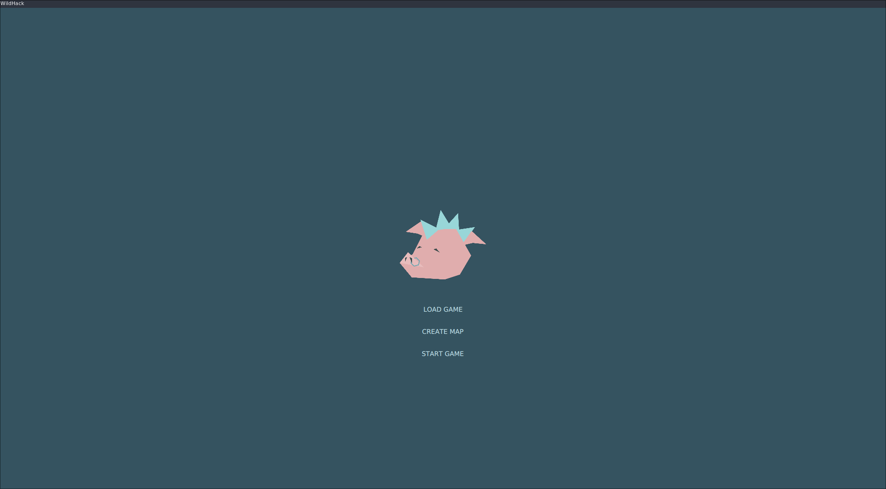
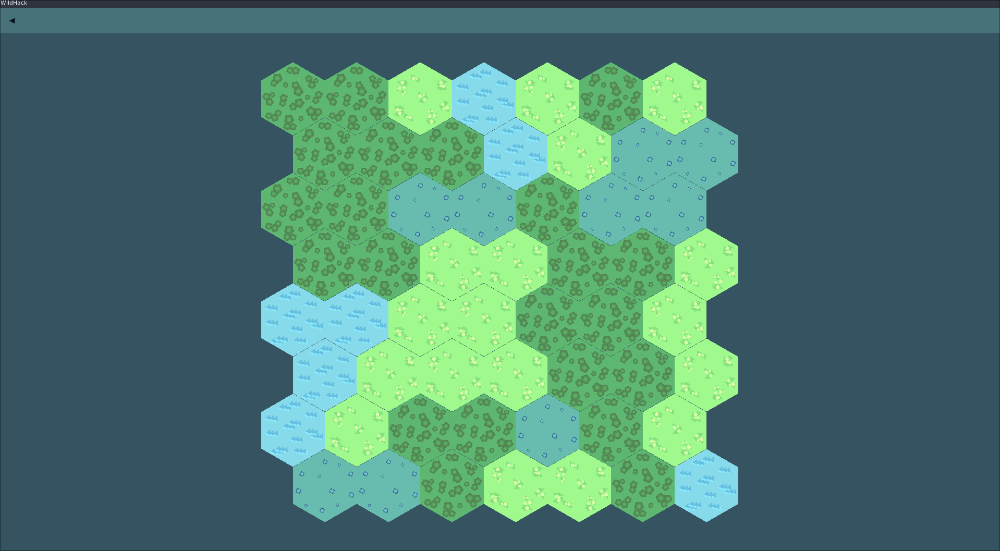
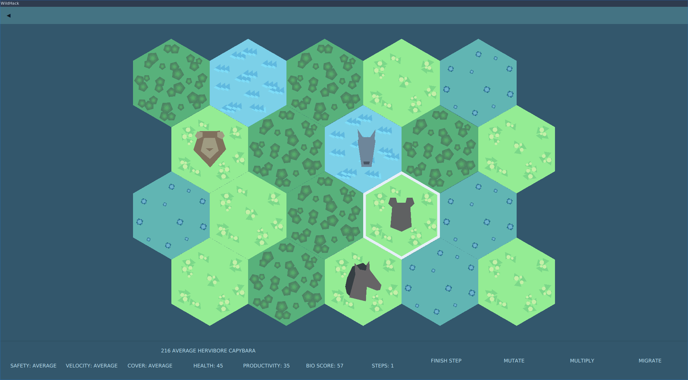
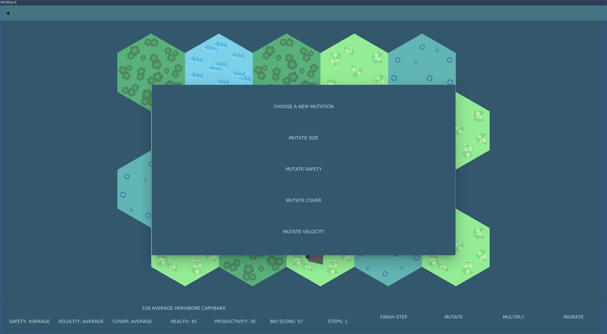

# WildHack

[](https://github.com/NikitaEvs/peach/actions)
[](https://github.com/NikitaEvs/peach/actions)

_The game about animals and more_









Game mechanics described [here](docs/gameplay.md)

Running [the example](test/test.cpp) with cells, map and population generation

```shell script
mkdir build
cd build
cmake ..
make
cd bin
./example
```

In addition, it is possible to build Unit tests, GUI applications, and GUI tests, but this requires many
dependencies (installation scripts can be found [here](ci)). 

Build and run Unit tests (requires dependencies that are installed by the script [unitTest.sh](ci/unitTest.sh))

```shell script
mkdir build
cd build
cmake -DTEST_BUILD=ON ..
make
cd bin
./gtest
```

Building and running the GUI (requires dependencies that are installed by the script [gui.sh](ci/gui.sh))

Now you can play!

```shell script
mkdir build
cd build
cmake -DGUI_BUILD=ON ..
make
cd bin
./gui --style material
```

If desired, you can customize the game world in the configuration [file](resources/config/values.json)

Build and run GUI tests (requires dependencies that are installed by the script [guiTest.sh](ci/guiTest.sh))

```shell script
mkdir build
cd build
cmake -DGUI_BUILD=ON -DGUI_TEST_BUILD=ON ..
make
cd bin
./guiTest
```

---
A description of the patterns used can be found [here](docs/patterns.md)

Documentation can be found [here](https://nikitaevs.github.io/peach)
